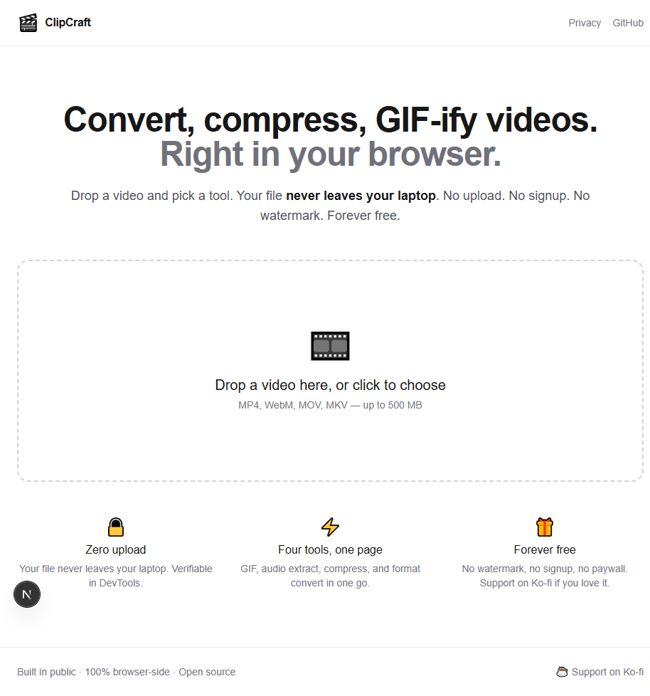

# ClipCraft — Autonomous Revenue Generator workspace

This repository is the workspace for an indie-hacker experiment:
**build, ship and grow a useful SaaS in 30 days, on a $0 budget**.

The product is [**ClipCraft**](./clipcraft/) — an in-browser video converter that runs entirely client-side (no upload, ever).



## Repository layout

```
.
├── clipcraft/           # The Next.js 16 app (see clipcraft/README.md)
├── docs/                # Specs, validation, launch material, screenshots
│   ├── PRD.md           # Product requirements doc
│   ├── ARCHITECTURE.md  # Stack + free-tier projection + decisions A001-A008
│   ├── COMPETITION.md   # 8 competitors analyzed
│   ├── VALIDATION.md    # Market signals + verdict + launch angles
│   ├── LAUNCH/          # 9 ready-to-paste posts for HN/Reddit/PH/etc.
│   ├── STANDUPS/        # Daily check-in template for Phase 6
│   ├── TECH-DEBT.md     # Known shortcuts and what to fix later
│   └── screenshots/     # Home + Privacy renders
├── MISSION.md           # 30-day plan
├── LOG.md               # Daily journal (every action)
├── METRICS.md           # Visitors / signups / revenue tracking
├── DECISIONS.md         # Why we picked each path (D001+)
├── CLAUDE.md            # Instructions for Claude (autonomous operator mode)
└── README.md            # this file
```

## Quick start

```bash
cd clipcraft
npm install
npm run dev
# → http://localhost:3000
```

See [`clipcraft/README.md`](./clipcraft/README.md) for full app details.

## How to read this repo

- **Want the product details?** → [`clipcraft/README.md`](./clipcraft/README.md)
- **Why this product?** → [`docs/PRD.md`](./docs/PRD.md) + [`docs/VALIDATION.md`](./docs/VALIDATION.md)
- **How is it built?** → [`docs/ARCHITECTURE.md`](./docs/ARCHITECTURE.md)
- **What's been done so far?** → [`LOG.md`](./LOG.md)
- **Why did we pick X over Y?** → [`DECISIONS.md`](./DECISIONS.md)
- **What's the launch plan?** → [`docs/LAUNCH/launch-checklist.md`](./docs/LAUNCH/launch-checklist.md)

## Status

🚀 **LIVE since 2026-05-23 (J1 evening)**.
- App: **https://clipcraftapp.vercel.app**
- Repo: **https://github.com/FreemaX94/clipcraft**
- Fallback URL: https://clipcraft-five.vercel.app

Targets at J+30 (2026-06-22):
- 🟢 Minimum: 100 unique visitors, 10 active users
- 🟡 Good: 1,000 visitors, 100 users, €1+ on Ko-fi
- 🟢 Excellent: 10,000 visitors, 500 users, €50+

## License

MIT for the application code under `clipcraft/`.
Documents under `docs/` are CC0 — reuse freely.
